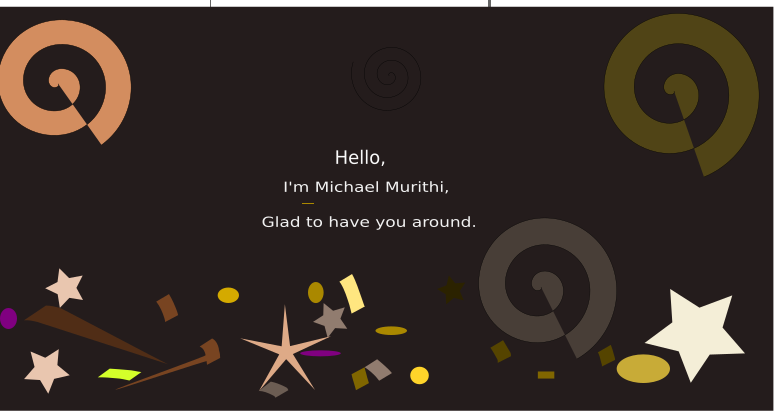

# My stats

# A walk through my Repos:
## Learning Playgrounds

## Fun Projects

## Life long learner

Exploring technology is my life. Everyday is a new day to improve and learn new concepts.
### Currently learning:
- API Design
- Technical writing
- Advanced C# .NET + Entity framework
- Low level C++

### Practicing 
- Django
- Nest js
- Next js
- Project workflows automation

### Experienced in
- Typescript
- Angular
- React
- Microsoft azure
- C# .NET
  
#### Want to learn with me or have some resources?

Reach out to me [here](https://www.linkedin.com/in/michael-murithi-kariuki/) for a pair-programming session or a team project.

### Have got some cool learning repos for you.... 

# A walk through my toungue

# Better Dev Hub
Here I feature some cool dev resources I have come across in the last 7 days

- [GitBook](https://www.gitbook.com/) - Publish beautiful docs for your users and centralize teams knowledge for advanced collaboration
- [Notebookjs](https://towardsdatascience.com/introducing-notebookjs-seamless-integration-between-python-and-javascript-in-computational-e654ec3fbd18) - Seemless integration between Python and Javascript in computational notebooks

<!-- # My Work week
 -->
****