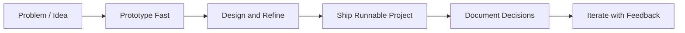

# Michael Murithi

Embedded Software Developer | Full-Stack Web Developer | AI Apps development enthusiast

I build practical software systems across hardware and web: from embedded and electronics work to production-style full-stack applications.

## What I Bring

- Cross-domain execution: embedded, backend, frontend, and automation.
- Product mindset: I structure projects so they are understandable, runnable, and reviewable.
- Learning velocity: I maintain active sandbox and prototype repositories to continuously sharpen skills across stacks.
- Collaboration-ready workflows: organized documentation, repeatable setup, and clear repository conventions.

## Featured Work

| Project | What it demonstrates | Stack |
|---|---|---|
| [web-app-prototypes](https://github.com/MichaelMurithi/web-app-prototypes) | Multi-project portfolio repo with two independently runnable products (Django app + full-stack TS monorepo) | Django, NestJS, React, TypeScript, PostgreSQL, Docker |
| [learning-sandbox](https://github.com/MichaelMurithi/learning-sandbox) | Structured multi-language learning environment with consistent commit conventions and ecosystem-specific playgrounds | Angular, React, Django, Python, C# |

## Engineering Focus

### Embedded and Electronics
- C++ and low-level systems programming
- Embedded Linux workflows
- Electronics prototyping, PCB design, soldering, and debugging

### Backend and APIs
- Django and NestJS application development
- REST API design and implementation
- C# .NET and Entity Framework foundations

### Frontend Development
- React, Angular, TypeScript, JavaScript
- Modern frontend tooling and component-driven UI work
- Python desktop GUI application development with PySide6

### DevOps, Cloud, and Automation
- Docker-based local and deployment workflows
- GitHub Actions and Azure DevOps pipelines
- Azure platform exposure
- Power Automate and n8n for workflow automation

## How I Build

```mermaid
flowchart LR
	A[Problem / Idea] --> B[Prototype Fast]
	B --> C[Design and Refine]
	C --> D[Ship Runnable Project]
	D --> E[Document Decisions]
	E --> F[Iterate with Feedback]
```

## Current Direction

- Expanding full-stack prototype quality with better architecture boundaries and deployment readiness.
- Deepening embedded + web crossover projects where hardware meets connected software.
- Exploring applied AI automation patterns for real-world developer and business workflows.

## Open To

- Full-time roles and contract opportunities in embedded systems, full-stack engineering, and automation engineering.
- Technical collaboration on practical, high-impact products.
- Collaborating on interesting open-source project ideas and community-driven initiatives.

## Contact

- LinkedIn: [michael-murithi-kariuki](https://www.linkedin.com/in/michael-murithi-kariuki/)
- GitHub: [@MichaelMurithi](https://github.com/MichaelMurithi)
